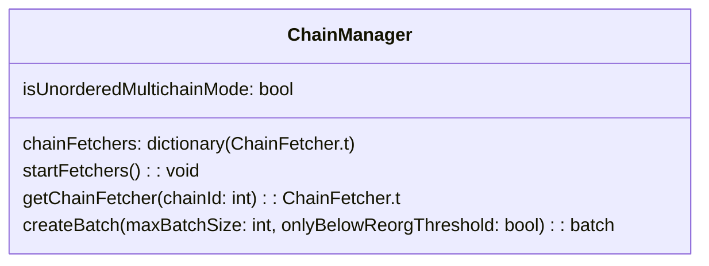
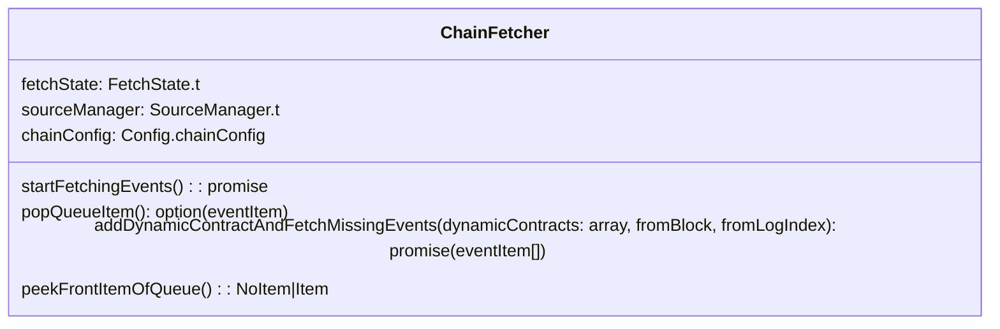
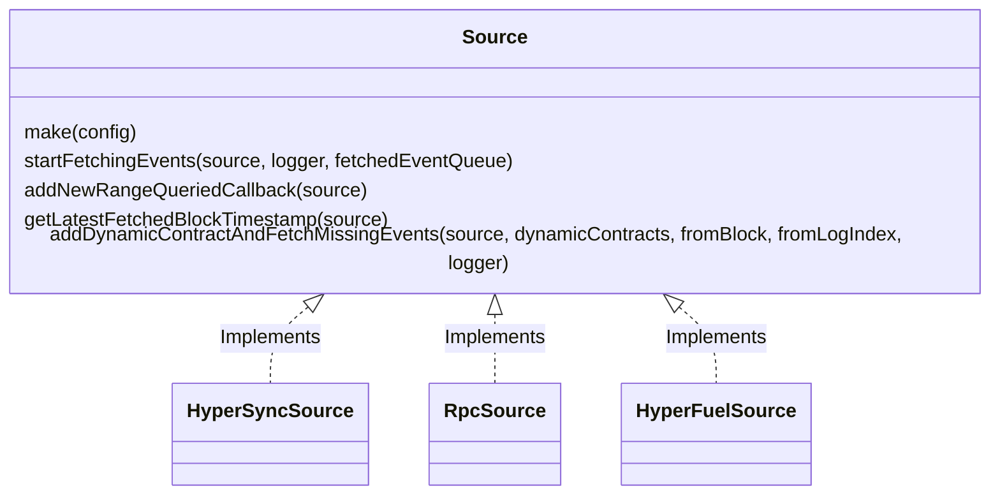

# Event Fetchers

The original [design diagrams](https://www.figma.com/file/YC7rKkGC65Out0QlQ2jxi9/Multi-queue-architecture?type=whiteboard&node-id=0-1&t=LpRK9cTFcHFaYaNO-0) are kept for context but the implementation has diverged. This document reflects the current fetcher architecture.

## ChainManager

`ChainManager` owns a `ChainFetcher` for every configured chain. `createBatch` peeks
all fetcher queues and selects the earliest events across chains. When running in
unordered mode it prioritises items below the reorg threshold so that contracts
can be registered on every chain before history is stored. Dynamic contract
registrations discovered during processing are queued for later batches.

## ChainFetcher

Each `ChainFetcher` maintains a queue of events for a single chain. It delegates
actual fetching to its `SourceManager` and keeps track of dynamic contracts and
reorg state.

## SourceManager

`SourceManager` coordinates one or more `Source` implementations for a chain. It
selects an active source (HyperSync, RPC or HyperFuel) and falls back when a
source stalls. Concurrency is limited based on configuration and metrics are
recorded for each source.

## Source

A `Source` encapsulates the logic for retrieving events from a particular data
provider. `HyperSyncSource` streams data from the HyperSync API, `RpcSource`
fetches via standard RPC endpoints and `HyperFuelSource` indexes Fuel networks.
All sources adhere to the same interface so `ChainFetcher` does not need to know
about implementation details such as block timestamp retrieval.

## ChainEventQueue

`ChainEventQueue` is an internal data structure created by the `ChainFetcher` and
shared with the active `Source`. It buffers fetched events and tracks state
needed for reorg detection.
