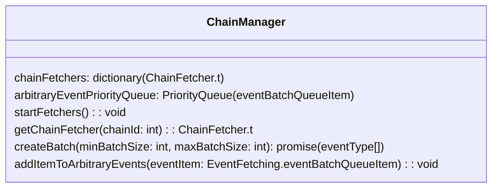
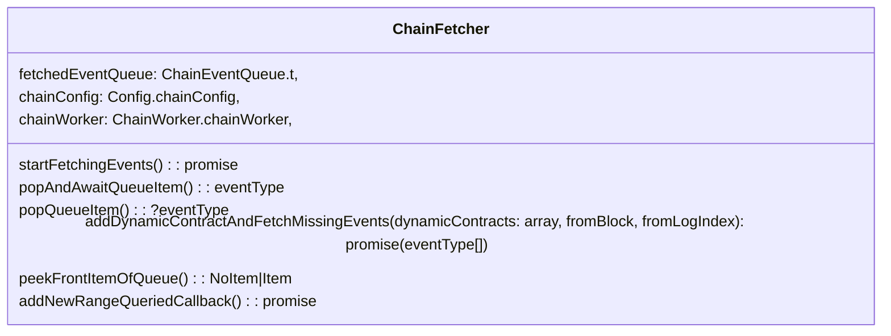
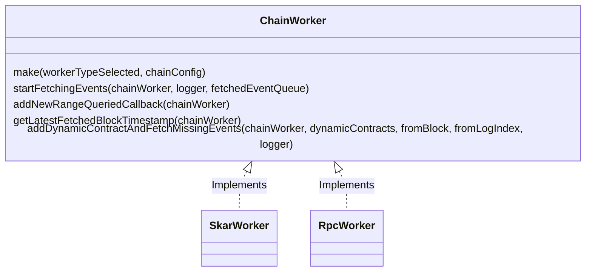

# Event Fetchers

Here are [the original diagrams](https://www.figma.com/file/YC7rKkGC65Out0QlQ2jxi9/Multi-queue-architecture?type=whiteboard&node-id=0-1&t=LpRK9cTFcHFaYaNO-0), put here for reference, - but they don't represent the most up-to-date plans.

## ChainManager

This manages the main queue that items for the batches are pulled from.

The high level of how this works currently is each chain queue and the arbitrary events queue are peeked to see if they contain the lowest item and then they return it.
TODO: This could be implemented more efficiently by an internal queue only holds 1 item from each each chain at a time (eg. if there are 5 chains - the queue will always have 5 items in it) - you'd also need to track 'NoItems' in that queue so this becomes a bit more complicated. Internally every time an item is pulled from the `arbitraryEventPriorityQueue` it adds at item back from a chain queue that that event belonged to.

The arbitrary events queue is only going to get populated with items if there are dynamic contracts added with events.

TODO: currently the ChainManager is passed directly to the `EventProcessor` as discussed in `IndexerStrucutre.md` this is an antipatern - an interface or adaptor should be used. Additionally, the `addItemToArbitaryEvents` function is called directly - the EventProcessor should only consume what is given to it - it shouldn't directly be adding to the queue itself. Solution is to end the batch early when a new contract is registered - and then just fetch the next batch when it is ready (it might require blocking the batch until the new events have been fetched).

## ChainFetcher

The `startFetchingEvents` function is a thin function that directly calls to the appropriate ChainWorker to do the work of fetching the events.

## ChainWorker

A `ChainWorker` is an abstraction over the actual implementation of retrieving the events and adding them to the `ChainFetcher` queue. It should only interact with and be interacted with within our code from the ChainFetcher. For example - the skar worker already has the blocktimestamps for all events - whereas the RPC worker needs to fetch the blocks to get the timestamps - the rest of the algoritm doesn't need to know about these details.

Some values in the chain workers are accessed or used in different parts of the application even if those might be in the process of changing. To avoid this we turn accessing or using those into promises that resolve only once the processing that involves those values completes. This makes the code safe, eg look at `latestFetchedBlockNumber` in the Skar Worker.
TODO: it is a good pattern, but potentially risky since you need to remember to 'resolve' that promise afterwards. An idea might be to encapsulate the logic that uses that value into a function so that it is easy to see the scope of code in which that variable is 'locked'.

### Skar ChainWorker

High level steps:

- Determine which block to start fetching from and starting state
- loop indefinitely
  - Create the contract interfaces and fetch a batch of events from skar
  - Fetch block timestamps for all these blocks (could this not be integrated with skar to be a single query?)
    - Check if any dynamic contracts have been loaded - If there are discard all these contracts before processing or adding them to the queue.
  - Parse all the events fetched from skar
  - Finish updating state, release locked values and start loop again

## ChainEventQueue

This is a data structure with some utility functions that is created and managed by the `ChainFetcher` used and shared by the `ChainWorker`.
