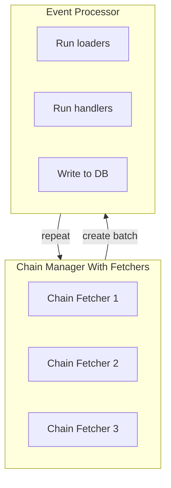

# Event Processor

The processor consumes batches produced by the `ChainManager`. Each batch is
executed in the following stages:

1. **Loaders** – preload any entities required by the handlers and allow dynamic
   contracts to be discovered. If a new contract is registered the remaining
   events are deferred until the contract's events are fetched.
2. **Handlers** – user code that transforms events into database mutations.
3. **Database write** – accumulated changes are written in a single transaction
   and metrics are updated.

The processor tracks reorg state for every chain and will roll back if the
fetchers detect invalid block hashes.
