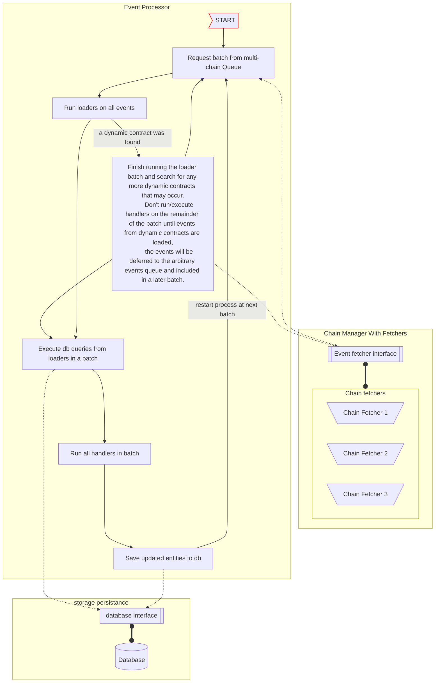

# Event Processor

High level digram of event processor loop:

```mermaid
flowchart TB
    subgraph cmq[Chain Manager With Fetchers]
    subgraph cfs[Chain fetchers]
      cf1[\Chain Fetcher 1/]
      cf2[\Chain Fetcher 2/]
      cf3[\Chain Fetcher 3/]
    end
    ei[["Event fetcher interface"]]o==ocfs
    end
    ei-.->1[Request batch from multi-chain Queue]
    subgraph ep[Event Processor]
        classDef start stroke:#f00
        start>START]:::start
        start-->1
        1-->2["Run loaders on all events"]
        2--"a dynamic contract was found"-->2a["Finish running the loader batch and search for any more dynamic contracts that may occur.
        Don't run/execute handlers on the remainder of the batch until events from dynamic contracts are loaded,
        the events will be deferred to the arbitrary events queue and included in a later batch."]
        2a-->1
        3["Execute db queries from loaders in a batch"]
        2a-->3
        2-->3
        3-->4["Run all handlers in batch"]
        4-->5["Save updated entities to db"]
        5--"restart process at next batch"-->1
    end
    2a-.->ei
    3-.->dbi
    5-.->dbi
    subgraph storage persistance
      dbi[["database interface"]]o==odb[(Database)]
    end
```
