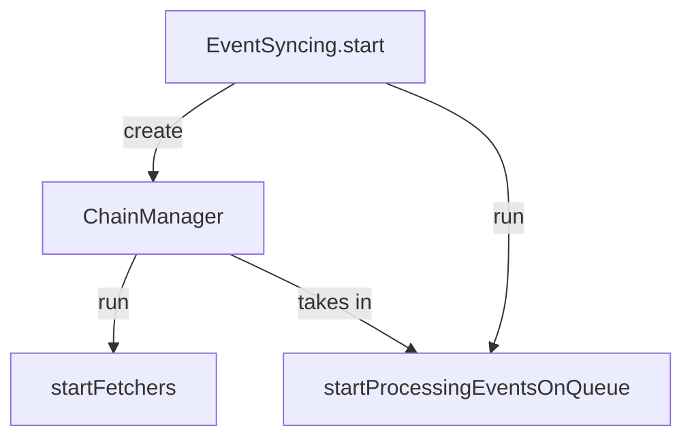
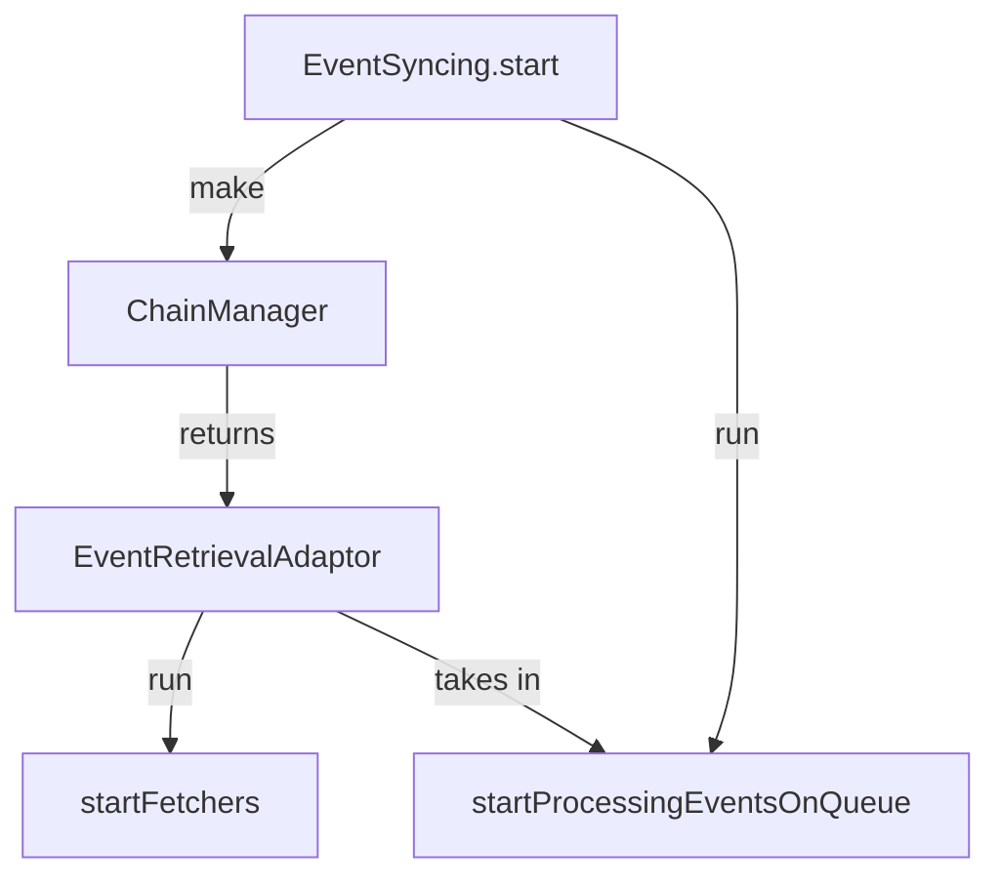

# Indexer Structure

The indexer runs two top level long running processes.

This is the 'event fetcher' (housed in the ChainManager) which fetches events continuously from different sources such as an RPC or Skar and the 'event processor'.

TODO: Currently the 'event processor' takes in the ChainManager, it would be better if the event processor only interacted with the ChainManager (and the queue that it pushes to) via connector of sorts which is a simplified interface. For example we call it `EventRetrievalAdaptor` or `EventRetrievalInterface`, this interface would restrict the possible interactions with the Queue that can be made from outside the system.

## Proposed:

Notes: The EventProcessor doesn't rely on the ChainManager directly, this is known as Inversion of Control (IoC); the benefit is that larger changes can be made to the ChainManager and its subcomponents without worry that they will effect EventProcessor if the adaptor remains intact. The Dependency Rule says that the direction of source code dependencies is inwards whene the inner most part are the core business rules. 
