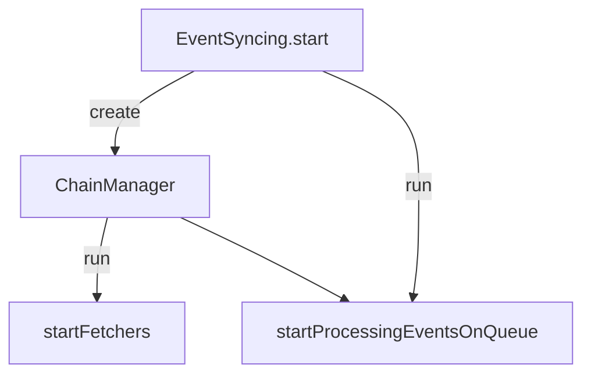

# Indexer Structure

The indexer is composed of two long‑running components:

1. **Event fetchers** – managed by `ChainManager`, these continuously pull events
   from multiple chains using the configured sources.
2. **Event processor** – consumes batches from the manager and writes results to
   the database.

The manager owns a `ChainFetcher` per chain. Each fetcher maintains a queue of
events populated via its `SourceManager`. The processor simply requests batches
from the manager and executes loaders and handlers.

### Future improvement

Ideally the processor would only depend on a lightweight interface (for example
`EventRetrievalAdaptor`) rather than the full `ChainManager`. This would allow
internal changes without affecting the processor.
